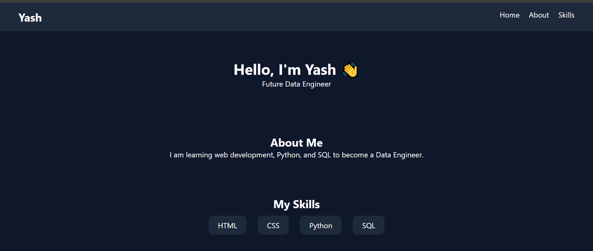

# 💼 Portfolio Website - Day 1 Project 15

## 📌 Project Overview

This project is a modern **Personal Portfolio Website** created as part of my semester challenge to build 200 websites.

It represents my personal profile, skills, and career goal as a future Data Engineer.

---

## 🎯 Features

* 💼 Navigation Bar
* 👤 Hero Section (Introduction)
* 📖 About Me Section
* 🧠 Skills Section
* 🎨 Clean and Professional UI

---

## 🛠️ Technologies Used

* HTML5
* CSS3 (Flexbox)

---

## 📂 Project Structure

```id="7w1g4y"
site-15-portfolio/
│
├── index.html
├── style.css
├── preview.png
└── README.md
```

---

## 📸 Preview



---

## 💡 Learning Outcome

* Learned personal portfolio design
* Practiced multi-section layout
* Built professional UI
* Improved UI/UX skills
* Strengthened Git & GitHub workflow

---

## 🔥 Author

**Yash Patil**
Future Data Engineer 🚀

---

## ⭐ Note

This project is part of my goal to build **200 websites** to improve my web development and design skills.
